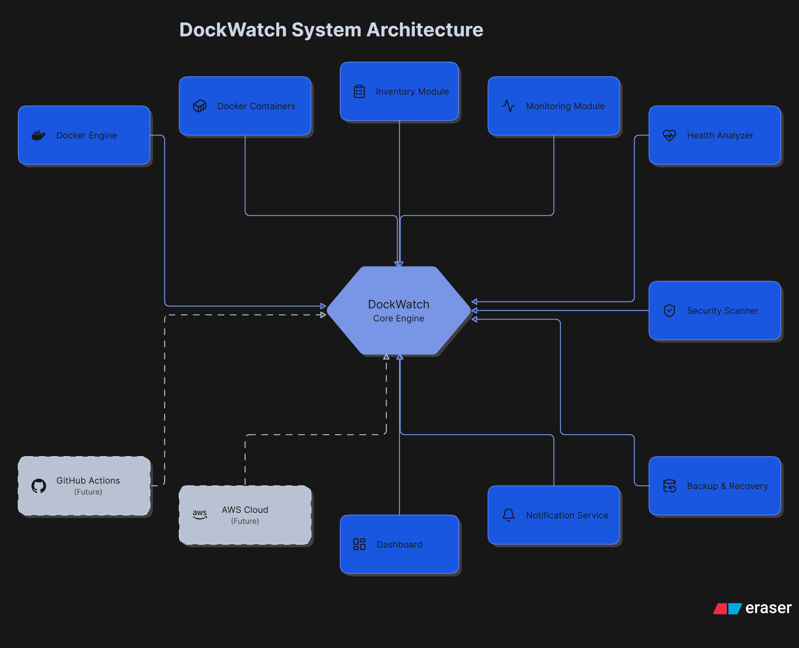

# DockWatch
Turning "Docker chaos" into "Docker control."

DockWatch is my open-source project aimed at fixing the headache of managing Docker environments. Instead of manually running docker ps or docker stats a hundred times a day, DockWatch acts as a sidekick that monitors your containers, spots security holes, and can even handle basic self-healing.

I’m building this to solve the "DevOps struggle": when you have enough containers running that you can’t possibly keep track of them all manually.

# The "Why"
If you’ve ever dealt with a container stuck in a restart loop, or realized too late that your disk is full, you know the pain. DockWatch handles the heavy lifting of:

Proactive Alerts: Stop guessing if your containers are actually healthy.
Security Guardrails: Catch things like running as root or exposed ports before they become issues.
Operational Sanity: From resource spikes to cleanup, I’m building this to take the manual labor out of Docker maintenance.

# My Vision
I want to build a tool that doesn't just show you data, but gives you insights.
Monitor: See exactly what’s happening in your infrastructure.
Analyze: Detect issues before they crash your app.
Recover: Let the system restart those "troublemaker" containers for you.

# What’s in the box? 
Inventory: A clean view of your containers, volumes, and networks.
Monitoring: Tracking CPU, RAM, and Disk usage in real-time.
Health Checks: Automatically flagging restart loops and zombie containers.
Security: Scanning for "gotchas" like privileged modes or missing best practices.
Self-Healing: The ability to auto-restart unhealthy containers and clean up junk files.
Backups: Simple, automated ways to back up your volumes and configs.
Notifications: Get the ping on Slack, Discord, or Telegram the moment something goes sideways.

# How I’m Building It
I’m a firm believer in learning by doing. The stack is currently focused on getting things running reliably on Linux:
Core: Bash & Python
OS: Ubuntu
Environment: Docker (obviously!)
Automation: GitHub Actions 

# 👩‍💻 About Me
I'm Sunaina Kasera, an aspiring DevOps engineer. I created DockWatch to bridge the gap between theory and the "real-world" challenges I'm encountering while studying Linux, Docker, and Cloud infrastructure.

A few tips on why this "human" version works better:
Removed "Corporate Speak": Words like "infrastructure management platform" or "centralized operational insights" were replaced with "fixing the headache" or "taking the manual labor out."

Added Personality: Using phrases like "troublemaker containers" or "the DevOps struggle" helps the reader connect with you, the creator.
Action-Oriented: Instead of just listing features, I framed them as things that help the user.
